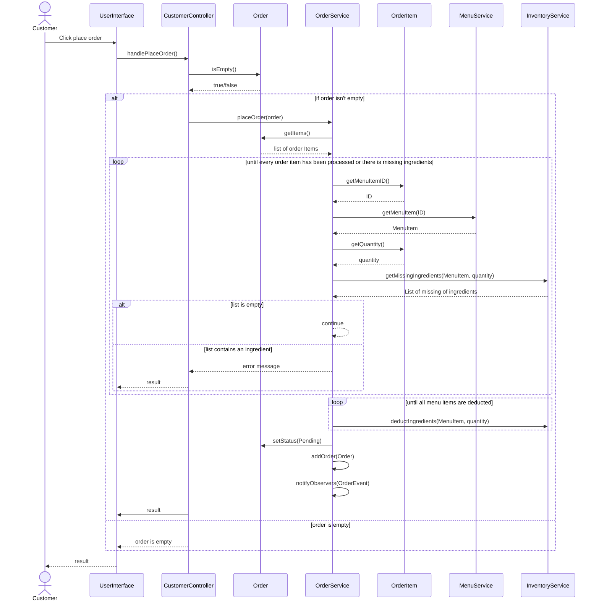
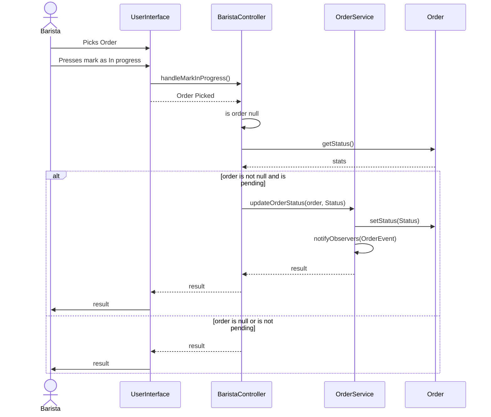
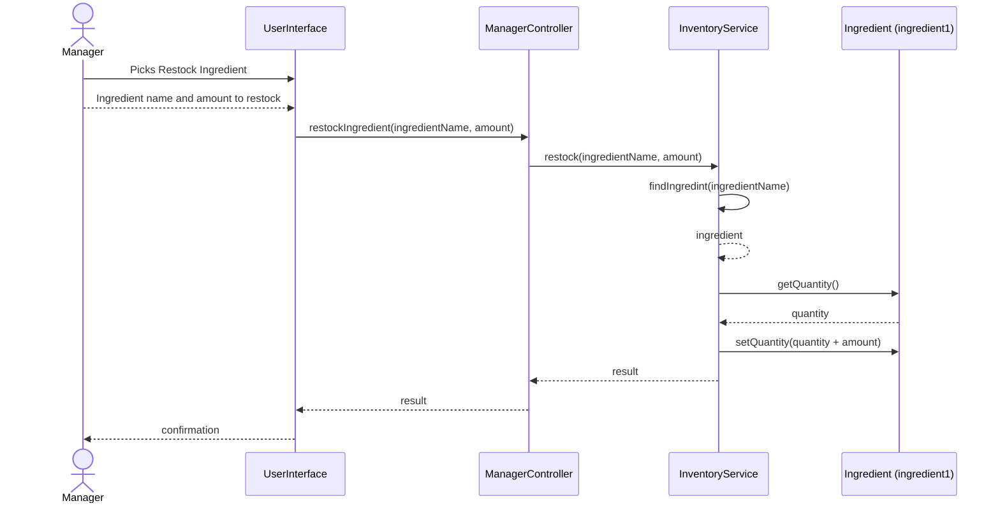

# ☕ Brew & Bite Café System

A JavaFX desktop application simulating a café ordering and management system.

---

## Table of Contents
- [User Roles & Credentials](#user-roles--credentials)
- [Building & Running](#building--running)
- [Project Structure](#project-structure)
- [Architectural Layers and MVC Structure](#architectural-layers-and-mvc-structure)
- [Justification for MVC Design Choices](#justification-for-mvc-design-choices)
  - [High Cohesion](#high-cohesion)
  - [Low Coupling](#low-coupling)
- [Applied OOP Principles and Design Patterns](#applied-oop-principles-and-design-patterns)
  - [Factory Pattern](#factory-pattern)
  - [Observer Pattern](#observer-pattern)
  - [Singleton Pattern](#singleton-pattern)
  - [OOP Principles](#oop-principles)
  - [SRP, Cohesion, Inheritance, Composition](#srp-cohesion-inheritance-composition)
    - [SRP](#srp)
    - [Cohesion](#cohesion)
    - [Inheritance](#inheritance)
    - [Composition](#composition)
- [Data Persistence](#data-persistence)
- [Key Design Decisions](#key-design-decisions)
- [Use Case Diagram](#use-case-diagram)
- [Conceptual Classes](#conceptual-classes)
- [UML Class Diagram](#uml-class-diagram)
- [Sequence Diagrams](#sequence-diagrams)
  - [Diagram A: Customer Places Order](#diagram-a-customer-places-order)
  - [Diagram B: Barista Changes Order Status to In Progress](#diagram-b-barista-changes-order-status-to-in-progress)
  - [Diagram C: Manager Restocks Ingredient](#diagram-c-manager-restocks-ingredient)
- [UI Wireframes](#ui-wireframes)
  - [Manager View](#manager-view)
  - [Customer View](#customer-view)
  - [Barista View](#barista-view)
---

## User Roles & Credentials

| Role    | Username | Password   |
|---------|----------|------------|
| Barista | barista1 | barista123 |
| Barista | barista2 | brew456    |
| Manager | manager1 | manager123 |
| Manager | admin    | admin2024  |

Customers do **not** need credentials — just enter a name at launch.

---

## Building & Running

### Prerequisites
- Java 21 LTS or newer
- Maven 3.8+

### Build executable JAR
```bash
mvn clean package
java -jar target/brew-and-bite-1.0.0.jar
```

> **Note on JavaFX + fat JARs**: The `maven-shade-plugin` bundles all dependencies.  
> On some systems you may need to pass JavaFX VM args explicitly:
>
> ```bash
> java --add-opens javafx.graphics/com.sun.javafx.application=ALL-UNNAMED \
>      -jar target/brew-and-bite-1.0.0.jar
> ```

---
## Project Structure

```text
brew-and-bite/
├── pom.xml
└── src/
    └── main/
        ├── java/com/brewandbite/
        │   ├── Main.java                         # Application entry point
        │   ├── MainApp.java                      # JavaFX bootstrap + service wiring
        │   ├── controller/
        │   │   ├── LandingController.java        # Role selection screen
        │   │   ├── LoginController.java          # Barista / Manager login
        │   │   ├── CustomerController.java       # Browse, customise, order
        │   │   ├── CustomerOrderStatusController.java  # Order tracking window
        │   │   ├── BaristaController.java        # View & fulfil orders
        │   │   └── ManagerController.java        # Menu, inventory, sales
        │   ├── model/
        │   │   ├── MenuItem.java                 # Abstract base (polymorphic JSON)
        │   │   ├── Beverage.java                 # Coffee / Tea items with sizes
        │   │   ├── Pastry.java                   # Croissant / Muffin / Cookie
        │   │   ├── Customization.java            # Add-on with extra cost
        │   │   ├── IngredientRequirement.java    # Item → ingredient mapping
        │   │   ├── Ingredient.java               # Inventory ingredient
        │   │   ├── Order.java                    # A customer's placed order
        │   │   ├── OrderItem.java                # One line in an order
        │   │   ├── UserRole.java                 # CUSTOMER | BARISTA | MANAGER
        │   │   ├── AppData.java                  # Root JSON wrapper
        │   │   ├── MenuItemRequest.java          # DTO for creating/editing menu items
        │   │   ├── MenuItemFactory.java          # Factory Method base
        │   │   ├── BeverageFactory.java          # Creates Beverage items
        │   │   └── PastryFactory.java            # Creates Pastry items
        │   ├── notification/
        │   │   ├── OrderObserver.java            # Observer interface
        │   │   ├── OrderEvent.java               # Event payload
        │   │   └── OrderEventType.java           # Event types enum
        │   ├── service/
        │   │   ├── AuthService.java              # Hardcoded credential check
        │   │   ├── InventoryService.java         # Stock check & deduction
        │   │   ├── MenuService.java              # Menu CRUD + persistence
        │   │   ├── OrderService.java             # Place & update orders + notify observers
        │   │   ├── PersistenceService.java       # Load/save JSON via Jackson
        │   │   └── FactoryService.java           # Chooses MenuItemFactory by type
        │   └── util/
        │       ├── SceneManager.java             # FXML scene switching
        │       ├── SessionStore.java             # Singleton app-wide state/services
        │       └── WindowManager.java            # Opens/clamps extra windows
        └── resources/com/brewandbite/
            ├── css/
            │   └── style.css                     # Coffee-themed stylesheet
            ├── data/
            │   └── seed_data.json                # Default menu & inventory
            └── view/
                ├── LandingView.fxml
                ├── LoginView.fxml
                ├── CustomerView.fxml
                ├── CustomerOrderStatusView.fxml  # New (Main-v2.0)
                ├── BaristaView.fxml
                ├── ManagerView.fxml
                └── module-info-placeholder.txt
```
## Architectural Layers and MVC Structure

The diagram above outlines the architectural layers of the application and illustrates how the components align with the **Model–View–Controller (MVC)** pattern implemented in this system.

---

## Justification for MVC Design Choices

### High Cohesion

- All **UI controller** components focus exclusively on user interface responsibilities, such as handling events and updating the view.
- All **domain classes** focus specifically on domain rules and application state.
- All **persistence classes** focus strictly on saving and loading data.

### Low Coupling

- The UI does not need to directly manipulate the model’s internal state.
- User actions are handled through the controller layer.
- The domain layer does not depend on JavaFX UI classes.
- Changes in the persistence layer require minimal changes outside that layer.

---

## Applied OOP Principles and Design Patterns

### Factory Pattern

The **Factory Pattern** was implemented to decouple the creation of menu items and hide concrete classes from the calling code.

- The UI requests an object, and the specific object type is determined by a factory.
- Callers depend on abstractions rather than concrete constructors.
- Concrete factory-related classes include:
  - `PastryFactory`
  - `MenuItemFactory`
  - `BeverageFactory`

### Observer Pattern

An **Observer Pattern** subsystem was explicitly implemented for menu updates using JavaFX’s built-in observable mechanisms, along with a separate subsystem for order events and notifications.

- Classes such as `OrderService`, `OrderEvent`, and `OrderObserver` follow the structure of the Observer Pattern.
- The model exposes observable state, and the UI updates automatically when that state changes.
- The UI does not directly call model code to force updates.

### Singleton Pattern

A **Singleton Pattern** is explicitly used in the system through `SessionStore`.

- It provides app-wide shared state and services.
- A single shared instance is enforced through `SessionStore`.
- This allows controllers to access shared state and services without requiring them to be passed through constructors.

### OOP Principles

One core OOP principle this project follows is **Abstraction** because controller components interact with the system through interfaces instead of directly manipulating data themselves. 
-High Level service classes handle communication between the domain logic and the UI
-Concrete classes that utilize this principle include:
  -`OrderService`
  -`InventoryService`
  -`PersistenceService`
  -`MenuService`
  

### SRP, Cohesion, Inheritance, Composition

#### SRP
- Domain/model classes each have one job: to represent their data and behaviors.
- Service classes also have one core function: to coordinate specific use cases.
- Each part of the system is clearly separated by responsibility.

#### Cohesion
- Controllers are cohesive because they only handle the view.
- Domain classes are cohesive because they represent domain state.
- Persistence classes are also cohesive because they only manage data input and output.

#### Inheritance
- Inheritance is used in classes like `MenuItem`, `Beverage`, and `Pastry`.
- `MenuItem` is the abstract class.
- `Beverage` and `Pastry` extend behavior from `MenuItem`.

#### Composition
- `Order` contains a `List<OrderItem>`, which shows a clear has-a relationship.
- Services are composed of other services.
- Menu items are composed of smaller domain objects:
  - `Beverage` contains `Customization`, another clear example of a has-a relationship.
  

---


## Data Persistence

All application state is saved to `~/.brewandbite/appdata.json` on exit and reloaded on startup.

If no save file is found, `seed_data.json` is loaded from the classpath to populate the initial menu and inventory.

---

## Key Design Decisions

| Concern | Approach |
|---------|----------|
| Polymorphic JSON | `@JsonTypeInfo` + `@JsonSubTypes` on `MenuItem` |
| Real-time UI updates | `ObservableList` in `OrderService` / `MenuService` |
| Inventory guard | `InventoryService.canMakeItem()` checked before adding to cart |
| Scene navigation | `SceneManager.switchTo(fxmlPath)` from any controller |
| Shared state | `SessionStore` singleton holds all services |
| No Canvas drawing | Pure JavaFX layout nodes (VBox, TableView, TabPane, etc.) |

---

## Use Case Diagram

<p align="center">
  
</p>

---

## Conceptual Classes

| Conceptual Class Name | Translation into Software | Primary Responsibility |
| --------------------- | -------------------------- | ---------------------- |
| MenuItem | Is an abstract class that holds all relevant information of a menu Item in the system like ingredient requirements, name, base price, and type. Is a class in our system because it represents real world objects that the system must track. | Contains the base information and methods that menu item subtypes in the system require. |
| Order | Represents a vital aspect of the cafe system, which is the orders customers place. Orders contain the important information of an order like the order items, the name of the customer ordering, and timestamps. Multiple orders will be created and used at runtime. | Holds the important attributes of an order in the system and holds the status of the order that changes based on interactions from the barista. |
| OrderItem | Holds the extra information relating to a menu item in an order like count, unit price, customizations, and size. Orders hold this instead of the menu item. | Helps connect menu item objects and order objects, by containing the extra information apart of the relationship like count. |
| Sale | Didn't make into being apart of the software as its could be represented as an orders state. | N.A. |
| Customer | Was omitted because the system doesn't track customer information besides name, which can just be an attribute of order. | N.A. |
| Barista | Was omitted because the system isn't tracking barista information and a barista is simply an external actor. Their login is hard coded. | N.A. |
| Manager | Was omitted because the system isn't tracking barista information and a barista is simply an external actor. Their login is hard coded. | N.A. |
| Ingredient | Became the representation of an ingredient in the system that will be tracked and used in the system. | Contain the important information to represent ingredients in the system like name, unit, and amount. Has the important getters and setters to enable functionality like restocking. |
| IngredientRequirement | Represents the ingredient requirement of an individual ingredient a MenuItem has. | Contains the important information to connect ingredient objects and menu item objects with the amount of the specific ingredient a menu item is using. |
| Beverage | An extension of the Menu Item class that holds important attributes of beverages like available customizations, and sizes. | Extends the menu item class to enable the specific functionality of beverage menu items having customizations and sizes. |
| Pastry | An extension of the Menu Item Class that holds the extra attribute of a pastry, variation. | Extends the menu item class to enable the pastry specific attribute of variation to be represented in the system. |
| Customization | A class representing a possible customization a drink may have like oat milk. Contains the important information of a customization like extra charge and name. | Represents the customization a beverage can have. |
| MenuService | A collection class of menu items that maintains a collection of menu items that are exist in the system including ones that are simply disabled. | Maintains the menu items and enables searches and other important functionality like displaying the menu. |
| OrderService | A collection class of orders that maintains a collection of orders in the system helps the system do important functions on orders like updating their status. | Maintains the collection of orders in the system and enables search functionality and being able to update an orders status with their id and status. |
| InventoryService | A collection class that maintains a collection of the ingredients in the system and helps the system do important functions on ingredients like restock or deduction. | Maintains the collection of the ingredients in the system and enables search functionality and important functions on ingredients like restocking or deduction after a menu item is placed. |
| BrewBiteCafe | Facade that was planned, but was omitted because of time constraints and the situation we were in with the system we had. | N.A. |

---

## UML Class Diagram

<p align="center">
    
</p>

---

## Sequence Diagrams

### Diagram A: Customer Places Order



**Design Choices**
- Part of the customer controller is that it contains the order the current customer is placing items on, so there wasn't any need to have the controller try to search the order as it is just one of its attributes. This was to follow the MVC structure and have controllers make the objects.
- Part of OrderService's responsibility is to enable important order functionality, so that is why we decided to let it do the brunt work of the use case like looping through the orders items of an order and sending them to the Inventory service to check if the items can be made.
- Order Service also has observers, that should be notified when orders are placed, which is why Order Service calls itself at the end of the place order method to notify its observers.

---

### Diagram B: Barista Changes Order Status to In Progress



**Design Choices**
- We had order do the updating because it is a part of the model and its primary responsibility is to maintain orders.
- We're using order service to separate the model and controller to lower coupling and improve cohesion as it should be OrderService, not the controller that does the updating.

---

### Diagram C: Manager Restocks Ingredient



**Design Choices**
- To follow the shoemaker principle we put the restock method in the InventoryService Class as it contains all the different ingredient objects in the system and can perform operations on them.
- Similar to the other two sequence diagrams, we have the controller more so call methods from classes in the model than perform the functions themselves to lower coupling between the controller and model layer.

---

## UI Wireframes

### Manager View
<p align="center">
  
</p>

### Customer View
<p align="center">
  
</p>

### Barista View
<p align="center">
  
</p>

