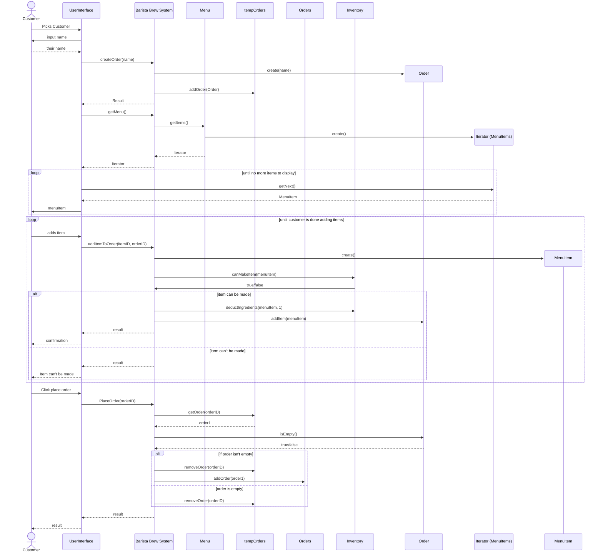
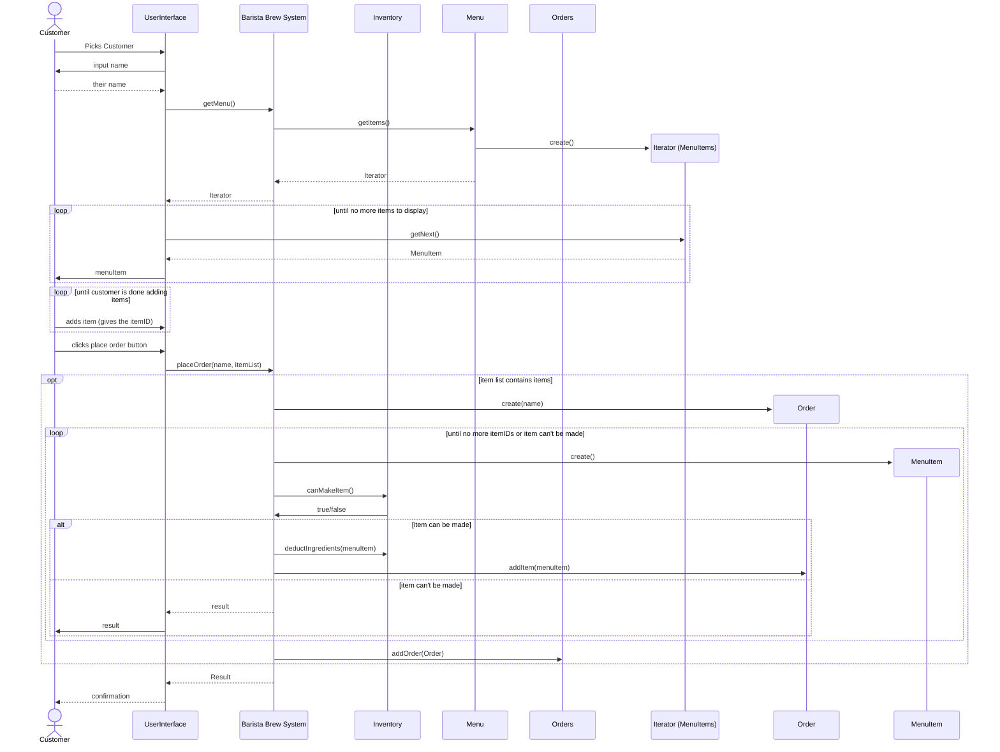
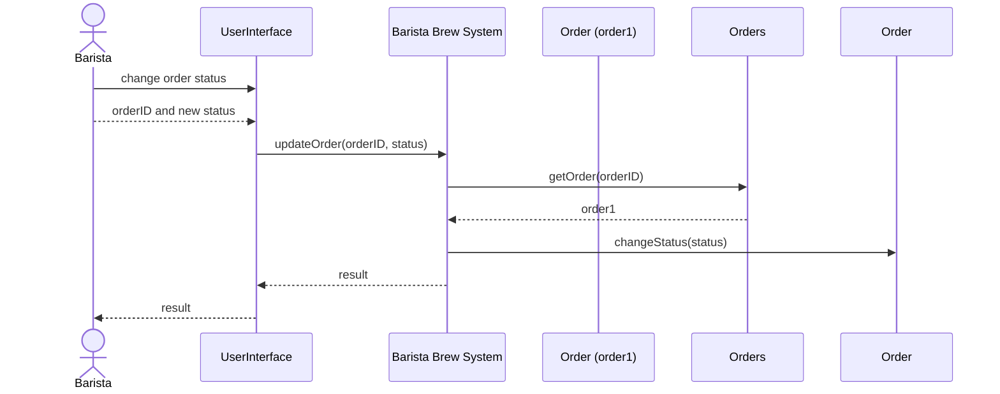
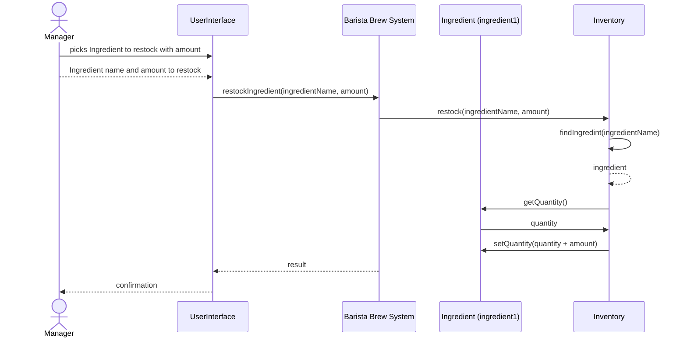

# ☕ Brew & Bite Café System

A JavaFX desktop application simulating a café ordering and management system.

---

## Project Structure

```
brew-and-bite/
├── pom.xml
└── src/
    └── main/
        ├── java/com/brewandbite/
        │   ├── Main.java                         # Application entry point
        │   ├── MainApp.java                      # JavaFX bootstrap + service wiring
        │   ├── controller/
        │   │   ├── LandingController.java        # Role selection screen
        │   │   ├── LoginController.java          # Barista / Manager login
        │   │   ├── CustomerController.java       # Browse, customise, order
        │   │   ├── CustomerOrderStatusController.java  # Order tracking window
        │   │   ├── BaristaController.java        # View & fulfil orders
        │   │   └── ManagerController.java        # Menu, inventory, sales
        │   ├── model/
        │   │   ├── MenuItem.java                 # Abstract base (polymorphic JSON)
        │   │   ├── Beverage.java                 # Coffee / Tea items with sizes
        │   │   ├── Pastry.java                   # Croissant / Muffin / Cookie
        │   │   ├── Customization.java            # Add-on with extra cost
        │   │   ├── IngredientRequirement.java    # Item → ingredient mapping
        │   │   ├── Ingredient.java               # Inventory ingredient
        │   │   ├── Order.java                    # A customer's placed order
        │   │   ├── OrderItem.java                # One line in an order
        │   │   ├── UserRole.java                 # CUSTOMER | BARISTA | MANAGER
        │   │   ├── AppData.java                  # Root JSON wrapper
        │   │   ├── MenuItemRequest.java          # DTO for creating/editing menu items
        │   │   ├── MenuItemFactory.java          # Factory Method base
        │   │   ├── BeverageFactory.java          # Creates Beverage items
        │   │   └── PastryFactory.java            # Creates Pastry items
        │   ├── notification/
        │   │   ├── OrderObserver.java            # Observer interface
        │   │   ├── OrderEvent.java               # Event payload
        │   │   └── OrderEventType.java           # Event types enum
        │   ├── service/
        │   │   ├── AuthService.java              # Hardcoded credential check
        │   │   ├── InventoryService.java         # Stock check & deduction
        │   │   ├── MenuService.java              # Menu CRUD + persistence
        │   │   ├── OrderService.java             # Place & update orders + notify observers
        │   │   ├── PersistenceService.java       # Load/save JSON via Jackson
        │   │   └── FactoryService.java           # Chooses MenuItemFactory by type
        │   └── util/
        │       ├── SceneManager.java             # FXML scene switching
        │       ├── SessionStore.java             # Singleton app-wide state/services
        │       └── WindowManager.java            # Opens/clamps extra windows
        └── resources/com/brewandbite/
            ├── css/
            │   └── style.css                     # Coffee-themed stylesheet
            ├── data/
            │   └── seed_data.json                # Default menu & inventory
            └── view/
                ├── LandingView.fxml
                ├── LoginView.fxml
                ├── CustomerView.fxml
                ├── CustomerOrderStatusView.fxml  # New (Main-v2.0)
                ├── BaristaView.fxml
                ├── ManagerView.fxml
                └── module-info-placeholder.txt
```

---

## User Roles & Credentials

| Role     | Username   | Password     |
|----------|------------|--------------|
| Barista  | barista1   | barista123   |
| Barista  | barista2   | brew456      |
| Manager  | manager1   | manager123   |
| Manager  | admin      | admin2024    |

Customers do **not** need credentials — just enter a name at launch.

---

## Building & Running

### Prerequisites
- Java 21 LTS or newer
- Maven 3.8+

### Run in development
```bash
mvn javafx:run
```

### Build executable JAR
```bash
mvn clean package
java -jar target/brew-and-bite-1.0.0.jar
```

> **Note on JavaFX + fat JARs**: The `maven-shade-plugin` bundles all dependencies.
> On some systems you may need to pass JavaFX VM args explicitly:
> ```bash
> java --add-opens javafx.graphics/com.sun.javafx.application=ALL-UNNAMED \
>      -jar target/brew-and-bite-1.0.0.jar
> ```

---

## Data Persistence

All application state is saved to `~/.brewandbite/appdata.json` on exit and
reloaded on startup. If no save file is found, `seed_data.json` is loaded from
the classpath to populate the initial menu and inventory.

---

## Key Design Decisions

| Concern | Approach |
|---------|----------|
| Polymorphic JSON | `@JsonTypeInfo` + `@JsonSubTypes` on `MenuItem` |
| Real-time UI updates | `ObservableList` in `OrderService` / `MenuService` |
| Inventory guard | `InventoryService.canMakeItem()` checked before adding to cart |
| Scene navigation | `SceneManager.switchTo(fxmlPath)` from any controller |
| Shared state | `SessionStore` singleton holds all services |
| No Canvas drawing | Pure JavaFX layout nodes (VBox, TableView, TabPane, etc.) |

---

### Use Case Diagram

<p align="center">
	
</p>


### Conceptual Classes
---
| Conceptual Class Name | Translation into Software                                                                                                                                                                                                                                             | Primary Responsibility                                                                                                                                                                      |
| --------------------- | --------------------------------------------------------------------------------------------------------------------------------------------------------------------------------------------------------------------------------------------------------------------- | ------------------------------------------------------------------------------------------------------------------------------------------------------------------------------------------- |
| MenuItem              | Is an abstract class that holds all relevant information of a menu Item in the system like ingredient requirements, name, base price, and type. Is a class in our system because it represents real world objects that the system must track.                         | Contains the base information and methods that menu item subtypes in the system require.                                                                                                    |
| Order                 | Represents a vital aspect of the cafe system, which is the orders customers place. Orders contain the important information of an order like the order items, the name of the customer ordering, and timestamps. Multiple orders will be created and used at runtime. | Holds the important attributes of an order in the system and holds the status of the order that changes based on interactions from the barista.                                             |
| OrderItem             | Holds the extra information relating to a menu item in an order like count, unit price, customizations, and size. Orders hold this instead of the menu item.                                                                                                          | Helps connect menu item objects and order objects, by containing the extra information apart of the relationship like count.                                                                |
| Sale                  | Didn't make into being apart of the software as its could be represented as an orders state.                                                                                                                                                                          | N.A.                                                                                                                                                                                        |
| Customer              | Was omitted because the system doesn't track customer information besides name, which can just be an attribute of order.                                                                                                                                              | N.A.                                                                                                                                                                                        |
| Barista               | Was omitted because the system isn't tracking barista information and a barista is simply an external actor. Their login is hard coded.                                                                                                                               | N.A.                                                                                                                                                                                        |
| Manager               | Was omitted because the system isn't tracking barista information and a barista is simply an external actor. Their login is hard coded.                                                                                                                               | N.A.                                                                                                                                                                                        |
| Ingredient            | Became the representation of an ingredient in the system that will be tracked and used in the system.                                                                                                                                                                 | Contain the important information to represent ingredients in the system like name, unit, and amount. Has the important getters and setters to enable functionality like restocking.        |
| IngredientRequirement | Represents the ingredient requirement of an individual ingredient a MenuItem has.                                                                                                                                                                                     | Contains the important information to connect ingredient objects and menu item objects with the amount of the specific ingredient a menu item is using.                                     |
| Beverage              | An extension of the Menu Item class that holds important attributes of beverages like available customizations, and sizes.                                                                                                                                            | Extends the menu item class to enable the specific functionality of beverage menu items having customizations and sizes.                                                                    |
| Pastry                | An extension of the Menu Item Class that holds the extra attribute of a pastry, variation.                                                                                                                                                                            | Extends the menu item class to enable the pastry specific attribute of variation to be represented in the system.                                                                           |
| Customization         | A class representing a possible customization a drink may have like oat milk. Contains the important information of a customization like extra charge and name.                                                                                                       | Represents the customization a beverage can have.                                                                                                                                           |
| MenuService           | A collection class of menu items that maintains a collection of menu items that are exist in the system including ones that are simply disabled.                                                                                                                      | Maintains the menu items and enables searches and other important functionality like displaying the menu.                                                                                   |
| OrderService          | A collection class of orders that maintains a collection of orders in the system helps the system do important functions on orders like updating their status.                                                                                                        | Maintains the collection of orders in the system and enables search functionality and being able to update an orders status with their id and status.                                       |
| InventoryService      | A collection class that maintains a collection of the ingredients in the system and helps the system do important functions on ingredients like restock or deduction.                                                                                                 | Maintains the collection of the ingredients in the system and enables search functionality and important functions on ingredients like restocking or deduction after a menu item is placed. |
| BrewBiteCafe          | Facade that was planned, but was omitted because of time constraints and the situation we were in with the system we had.                                                                                                                                             | N.A.                                                                                                                                                                                        |

### UML Class Diagram


### Sequence Diagrams 
### Diagram A: Customer Places Order
**Sequence Diagram A**


**Sequence Diagram B**



### Diagram B: Customer Places Order
**Sequence Diagram A**



### Diagram C: Manger restocks Ingredient
**Sequence Diagram A**

---


## UI Wireframes

### Manager View
<p align="center">
  
</p>

### Customer View
<p align="center">
  
</p>

### Barista View
<p align="center">
  
</p>
