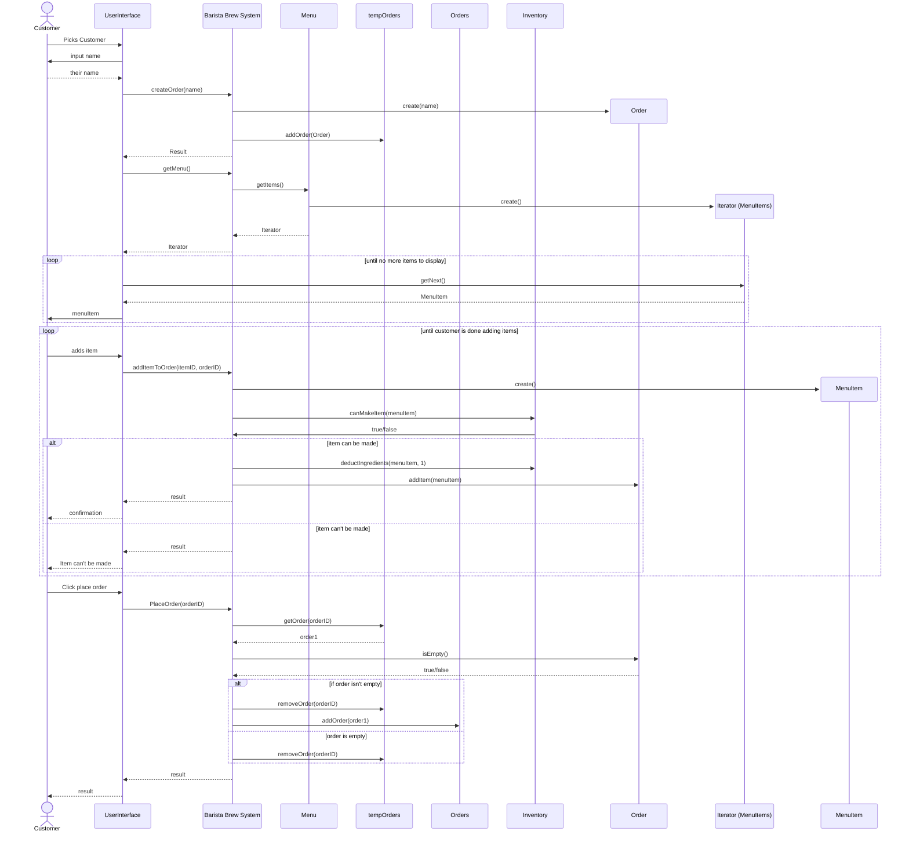
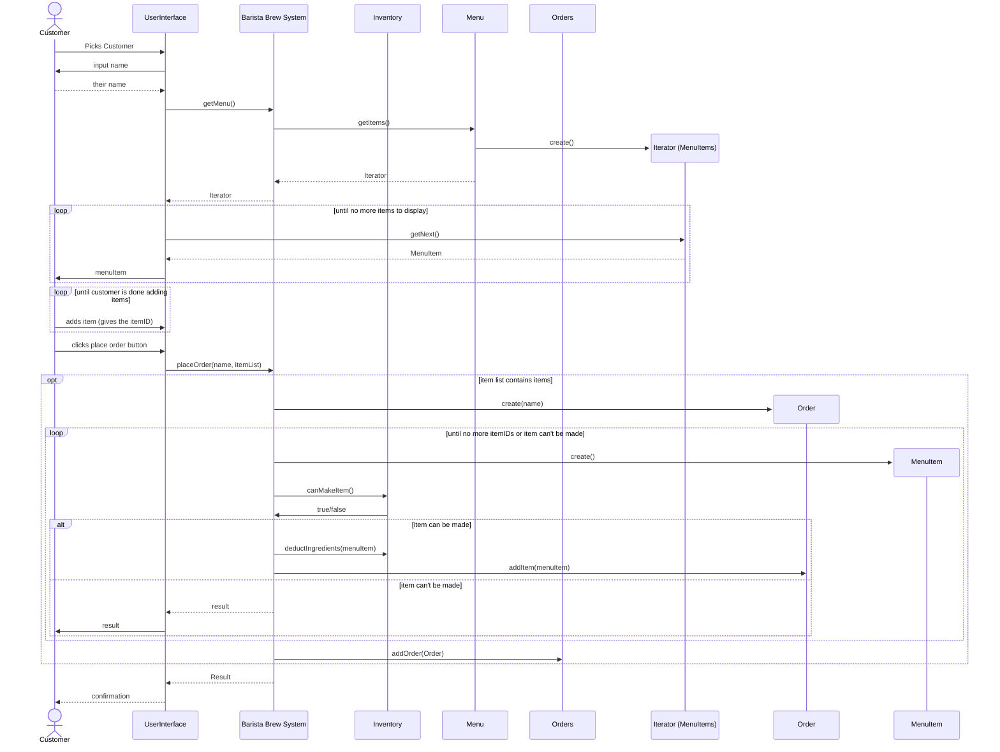
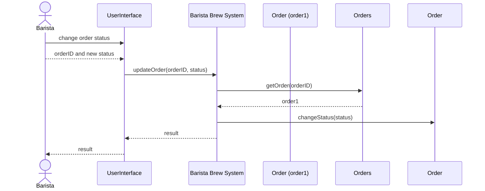
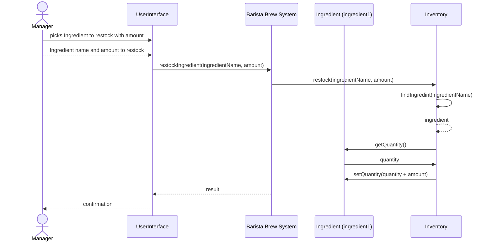

# ☕ Brew & Bite Café System

A JavaFX desktop application simulating a café ordering and management system.

---

## Project Structure

```
brew-and-bite/
├── pom.xml
└── src/
    └── main/
        ├── java/com/brewandbite/
        |   ├── Main.java                         # Application entry point
        │   ├── MainApp.java                      
        │   ├── model/
        │   │   ├── MenuItem.java                 # Abstract base (polymorphic JSON)
        │   │   ├── Beverage.java                 # Coffee / Tea items with sizes
        │   │   ├── Pastry.java                   # Croissant / Muffin / Cookie
        │   │   ├── Customization.java            # Add-on with extra cost
        │   │   ├── IngredientRequirement.java    # Item → ingredient mapping
        │   │   ├── Ingredient.java               # Inventory ingredient
        │   │   ├── Order.java                    # A customer's placed order
        │   │   ├── OrderItem.java                # One line in an order
        │   │   ├── UserRole.java                 # CUSTOMER | BARISTA | MANAGER
        │   │   └── AppData.java                  # Root JSON wrapper
        │   ├── service/
        │   │   ├── AuthService.java              # Hardcoded credential check
        │   │   ├── InventoryService.java         # Stock check & deduction
        │   │   ├── MenuService.java              # Observable menu CRUD
        │   │   ├── OrderService.java             # Place & update orders
        │   │   └── PersistenceService.java       # Load/save JSON via Jackson
        │   ├── controller/
        │   │   ├── LandingController.java        # Role selection screen
        │   │   ├── LoginController.java          # Barista / Manager login
        │   │   ├── CustomerController.java       # Browse, customise, order
        │   │   ├── BaristaController.java        # View & fulfil orders
        │   │   └── ManagerController.java        # Menu, inventory, sales
        │   └── util/
        │       ├── SceneManager.java             # FXML scene switching
        │       └── SessionStore.java             # Singleton app-wide state
        └── resources/com/brewandbite/
            ├── css/style.css                     # Coffee-themed stylesheet
            ├── data/seed_data.json               # Default menu & inventory
            └── view/
                ├── LandingView.fxml
                ├── LoginView.fxml
                ├── CustomerView.fxml
                ├── BaristaView.fxml
                └── ManagerView.fxml
```

---

## User Roles & Credentials

| Role     | Username   | Password     |
|----------|------------|--------------|
| Barista  | barista1   | barista123   |
| Barista  | barista2   | brew456      |
| Manager  | manager1   | manager123   |
| Manager  | admin      | admin2024    |

Customers do **not** need credentials — just enter a name at launch.

---

## Building & Running

### Prerequisites
- Java 21 LTS or newer
- Maven 3.8+

### Run in development
```bash
mvn javafx:run
```

### Build executable JAR
```bash
mvn clean package
java -jar target/brew-and-bite-1.0.0.jar
```

> **Note on JavaFX + fat JARs**: The `maven-shade-plugin` bundles all dependencies.
> On some systems you may need to pass JavaFX VM args explicitly:
> ```bash
> java --add-opens javafx.graphics/com.sun.javafx.application=ALL-UNNAMED \
>      -jar target/brew-and-bite-1.0.0.jar
> ```

---

## Data Persistence

All application state is saved to `~/.brewandbite/appdata.json` on exit and
reloaded on startup. If no save file is found, `seed_data.json` is loaded from
the classpath to populate the initial menu and inventory.

---

## Key Design Decisions

| Concern | Approach |
|---------|----------|
| Polymorphic JSON | `@JsonTypeInfo` + `@JsonSubTypes` on `MenuItem` |
| Real-time UI updates | `ObservableList` in `OrderService` / `MenuService` |
| Inventory guard | `InventoryService.canMakeItem()` checked before adding to cart |
| Scene navigation | `SceneManager.switchTo(fxmlPath)` from any controller |
| Shared state | `SessionStore` singleton holds all services |
| No Canvas drawing | Pure JavaFX layout nodes (VBox, TableView, TabPane, etc.) |


### Sequence Diagrams 
### Diagram A: Customer Places Order
**Sequence Diagram A**


**Sequence Diagram B**



### Diagram B: Customer Places Order
**Sequence Diagram A**



### Diagram C: Manger restocks Ingredient
**Sequence Diagram A**


